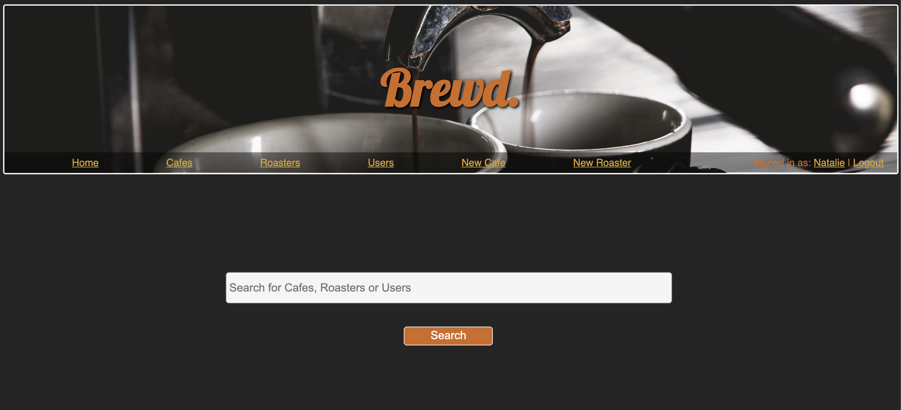

# **brewd.**

## [Link](https://arcane-anchorage-52778.herokuapp.com/)
##### brewd. (v1.0) - By Steven Furnari

## **Project**

The aim of this project was to build a working, full-stack website using Rails with ActiveRecord.
The back-end has multiple models to represent the data using RESTful routes and hosted online using Heroku.

## **Description**

A simple website where users can view, rate and add their favourite cafes and coffee roasters.

## **Future Updates**
Future updates will include -
- User follow system
- Embedded maps, with multiple markers
- Check-in system when visiting cafes